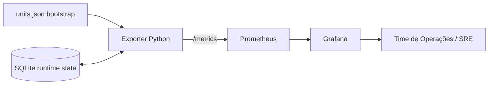
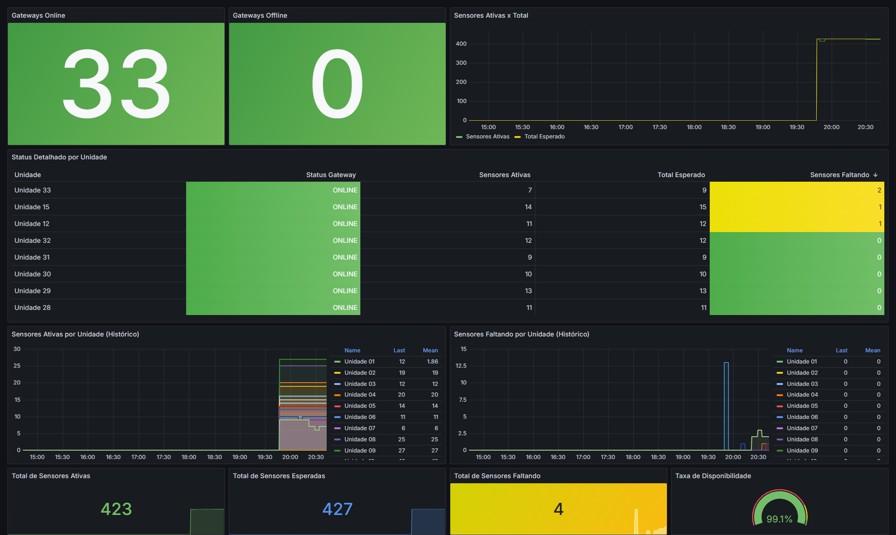

# Sentinela de Rede


Projeto de observabilidade para monitoramento de endpoints de rede em ambientes distribuídos. Foi desenhado como um caso real de operação: detectar perda de disponibilidade rapidamente, manter baseline histórico por unidade e dar visibilidade acionável para times de operação e SRE.

## Caso de uso real

Cenário típico: empresa com dezenas de unidades remotas (educação, varejo, industrial), cada uma com gravador de vídeo e câmeras IP na mesma rede local.

Problema operacional recorrente:

1. Queda parcial de endpoints (algumas câmeras offline) passa despercebida por horas.
2. Inventário de endpoints ativos fica desatualizado.
3. Times perdem tempo com troubleshooting manual, unidade por unidade.

Como este sistema atua:

1. Descobre endpoints ativos por unidade.
2. Mantém estado persistido para evitar varredura total desnecessária em todos os ciclos.
3. Expõe métricas padrão Prometheus para consulta e alerta.
4. Entrega dashboards operacionais no Grafana prontos para tomada de decisão.

## Arquitetura de observabilidade



Componentes:

1. Exporter em Python: discovery, health-check de endpoints e exposição de métricas.
2. SQLite: persistência de unidades, runtime state e trilha de auditoria de baseline.
3. Prometheus: coleta periódica e armazenamento de séries temporais.
4. Grafana: visualização operacional por perfil de negócio.

## Estratégia de discovery

O discovery prioriza eficiência operacional sem perder cobertura.

1. Bootstrap inicial:
	Carrega unidades do banco SQLite; se vazio, inicializa com units.json.
2. Varredura incremental:
	Em ciclos normais, verifica primeiro IPs já conhecidos para reduzir custo de scan.
3. Full scan periódico:
	Executa varredura completa por sub-rede a cada N ciclos (FULL_SCAN_EVERY_CYCLES).
4. Fallback por degradação:
	Se a contagem ativa cai muito versus histórico conhecido, antecipa full scan para reduzir falso negativo operacional.

Resultado prático: menos ruído, menor tempo de ciclo e descoberta robusta mesmo com mudanças de rede.

## Persistência de estado

A persistência local em SQLite evita comportamento "stateless" caro e melhora previsibilidade.

Tabelas principais:

1. units: cadastro operacional das unidades e baseline esperado.
2. runtime_state: último estado do monitoramento por unidade.
3. known_camera_ips: cache de endpoints conhecidos para scans incrementais.
4. baseline_audit: histórico de ajustes de baseline com motivo.

Impacto operacional:

1. Reboot/redeploy não perde contexto de monitoramento.
2. Evita reprocessamento completo a cada ciclo.
3. Facilita auditoria de mudanças no baseline de endpoints.

## Por que Prometheus e Grafana

Prometheus:

1. Formato aberto de métricas e ecossistema consolidado para SRE.
2. Modelo pull simples para ambientes locais e containerizados.
3. Facilita alertas com regras e consulta temporal (PromQL).

Grafana:

1. Curva de adoção baixa para times de operação.
2. Dashboards versionados no repositório.
3. Provisioning automático de datasource e dashboards no docker compose.

Essa dupla maximiza portabilidade, padrão de mercado e velocidade de demonstração técnica em entrevista.

## Valor operacional para times

1. Operação NOC: identifica unidade com degradação de endpoints em minutos.
2. SRE: acompanha confiabilidade por ciclo (duração, erros, overrun).
3. Gestão técnica: compara baseline esperado vs disponibilidade real por perfil.
4. Engenharia de plataforma: reutiliza o padrão para novos cenários com baixo acoplamento.

## Resultados operacionais esperados

Metas realistas que este sistema ajuda a melhorar quando integrado ao fluxo de resposta:

1. Redução de MTTD de indisponibilidade parcial de endpoints: de horas para minutos.
2. Aumento de cobertura de monitoramento por unidade: aproximação de 100% dos endpoints conhecidos.
3. Redução de investigações manuais por incidente: triagem inicial orientada por dashboard e métricas.
4. Menor variação de baseline sem rastreabilidade: trilha de auditoria de ajustes no SQLite.
5. Melhor aderência a SLO operacional de disponibilidade: visibilidade contínua de cameras_active, cameras_missing e nvr_status.

Indicadores que podem ser acompanhados diretamente:

1. nvr_status
2. cameras_active
3. cameras_total
4. cameras_missing
5. scan_duration_seconds
6. exporter_cycle_duration_seconds
7. exporter_cycle_lag_seconds
8. school_scan_total
9. school_scan_errors_total
10. discovery_scan_total

## Execução local simples

Pré-requisitos:

1. Docker
2. Docker Compose

Subir ambiente:

```bash
docker compose up -d --build
```

Verificar containers:

```bash
docker compose ps
```

Acessos:

1. Exporter metrics: http://localhost:8000/metrics
2. Prometheus: http://localhost:9090
3. Grafana: http://localhost:3001

Credenciais Grafana:

1. Usuário: admin
2. Senha: admin

Parar ambiente:

```bash
docker compose down
```

## Evidências visuais obrigatórias para portfólio

Para acelerar percepção de senioridade técnica em processo seletivo, inclua no repositório (ou no README com imagens) as evidências abaixo.

Status atual sugerido para apresentação:

1. Disponível: screenshot de dashboard operacional.
2. Pendente para coleta em ambiente real (400+ ativos): fluxo de coleta e leitura de métricas em terminal.

Evidência disponível agora:



1. Screenshot de dashboard operacional:
	Mostrar pelo menos nvr_status, cameras_active e cameras_missing por unidade.
2. Fluxo de coleta fim-a-fim:
	Diagrama (Exporter -> Prometheus -> Grafana) com destaque para SQLite como estado.
3. Leitura real de endpoint de métricas:
	Captura de terminal com curl/wget no /metrics evidenciando séries coletadas.

Checklist de captura sugerido:

1. Subir stack com docker compose.
2. Abrir Grafana no dashboard provisionado.
3. Capturar painel com timestamp visível.
4. Rodar comando e registrar saída:

```bash
curl -s http://localhost:8000/metrics | grep -E "nvr_status|cameras_active|cameras_missing|scan_duration_seconds"
```

5. Inserir imagens na seção de evidências.

Guia de evidências no repositório: docs/evidencias/README.md

## Qualidade, testes e CI (estado atual)

Cobertura atual:

1. Testes unitários para parsing/configuração.
2. Testes para repositório SQLite.
3. Testes de compatibilidade de modelo de unidade.
4. Pipeline CI simples executando pytest em GitHub Actions.

## Estrutura do projeto

1. exporter.py: loop principal de monitoramento e métricas.
2. nvr_monitor/: módulos de config, discovery, repositório SQLite e compatibilidade.
3. config/prometheus/: configuração de scrape.
4. config/grafana/provisioning/: provisioning de datasource e dashboards.
5. dashboards/: dashboards operacionais por perfil.
6. tests/: testes unitários atuais.

## Dados e privacidade

1. Estado operacional em data/monitor.db.
2. units.json usado para bootstrap quando necessário.
3. Dados de exemplo anonimizados para demonstração pública.

## Licença

Este projeto está licenciado sob MIT. Consulte LICENSE.

## Autor

Diogo Carvalho
Backend Python | SRE / DevOps | Distributed Systems
